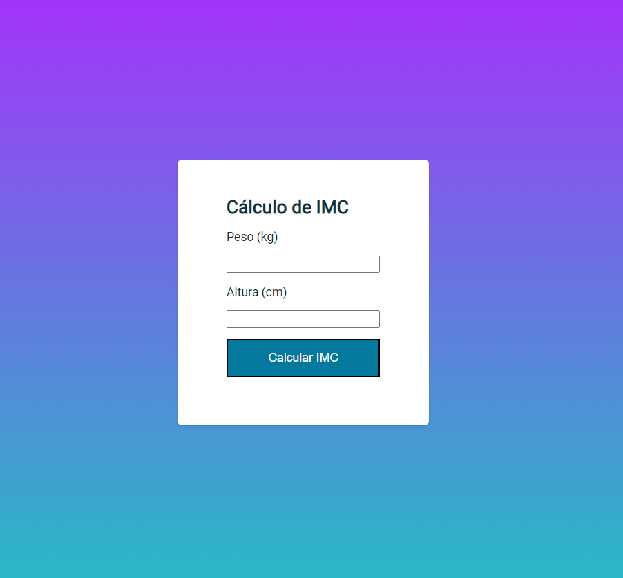

## Exercício JavaScript04 Rocketseat - Explorer
Calculadora de IMC com validação nos inputs, mensagem de erro e resultado sobrepondo a tela.
### [Clique aqui para ver o projeto](https://colelladev.github.io/exeJavaScript04/)

